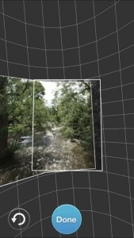

# Apps Overview

Apps that run on a phone or tablet are commonly used in 360 photography for several functions:

- viewing 360 photos interactively or with a VR headset
- taking a series of still images and stitching them into a panorama or photo sphere
- controlling a 360 camera
- uploading 360 images to the cloud to share

## 360 Viewer Apps

Many of the online platforms that specialize in creating and/or hosting 360 tours have their own apps for viewing 360 tours. Typically these apps support viewing 360s in VR headsets like [Google Cardboard](https://en.wikipedia.org/wiki/Google_Cardboard){target="+blank"}.

<table>
<tr style="background-color:transparent;">
<td class="appicon" style="border:none;"></td>
<td class="appdesc" style="border:none;">**Google Cardboard**. [Android](https://play.google.com/store/apps/details?id=com.google.samples.apps.cardboarddemo){target="_blank"} | [iTunes](https://itunes.apple.com/us/app/google-cardboard/id987962261){target="_blank"}

The Google Cardboard app is required if you're using a Google Cardboard style headset. Several sample 360 tours are provided.

</td>
</tr>

<tr style="background-color:transparent;">
<td class="appicon" style="border:none;"></td>
<td class="appdesc" style="border:none;">**RoundMe**. [Android](https://play.google.com/store/apps/details?id=me.round.app){target="_blank"} | [iTunes](https://itunes.apple.com/us/app/roundme/id839493812){target="_blank"}

RoundMe is one of the more popular online platforms for creating and hosting 360s tours. While you can you view RoundMe tours in a browser, the app provides additional features including searching. When using a VR headset, you can 'click' a hotspot by keeping it in the center of the frame for a couple of seconds.

</td>
</tr>

<tr style="background-color:transparent;">
<td class="appicon" style="border:none;"></td>
<td class="appdesc" style="border:none;">**Kuula**. [Android](https://play.google.com/store/apps/developer?id=Kuula&hl=en){target="_blank"} | [iTunes](https://itunes.apple.com/us/app/kuulavr/id1193732375){target="_blank"}

Kuula.com is another popular hosting service with its own app.

</td>
</tr></table>

## Smartphone camera apps

<table>
<tr style="background-color:transparent;">
<td class="appicon" style="border:none;">
</td>
<td class="appdesc" style="border:none;">**Cardboard Camera**. [Android](https://play.google.com/store/apps/details?id=com.google.vr.cyclops){target="_blank"} | [iTunes](https://itunes.apple.com/us/app/cardboard-camera/id1095487294){target="_blank"}

Google Cardboard Camera makes it easy to take nice panoramas. Features include exposure lock, which minimizes vertical banding, and recording sound. You can share panoramas you take via the usual options.

</td>
</tr>

<tr style="background-color:transparent;">
<td class="appicon" style="border:none;"></td>
<td class="appdesc" style="border:none;">**Google Camera**. 

The [Google Camera](https://en.wikipedia.org/wiki/Google_Camera){target="_blank"} app is only available on Nexus and Pixel Android devices (phones and tablets manufactured by Google). Unofficial versions may be available for other phones. It includes four panorama modes (Horizontal, Vertical, Wide-angle and Fisheye) as well as the ability to take a full-360 photosphere.

</td>
</tr>

<tr style="background-color:transparent;">
<td class="appicon" style="border:none;"></td>
<td class="appdesc" style="border:none;">**360 Panorama**. Android *- not available* | [iTunes](https://itunes.apple.com/us/app/360-panorama/id377342622){target="_blank"}

360 Panorama from Occipital is a $2 app for iPhones and iPads. It guides you in taking taking a series of photos by slowly pointing the camera in all directions. For best quality, try to keep the lens in roughly the same position. When done, the app will stitch the images for you.

</td>
</tr>

</table>

See also the [Google Street View](#gsv) app below, which also allows you to take 360 photos using just your phone.

## 360 Camera Apps

<table>
<tr style="background-color:transparent;">
<td class="appicon" style="border:none;"></td>
<td class="appdesc" style="border:none;">**Theta**. [Android](https://play.google.com/store/apps/details?id=com.theta360){target="_blank"} | [iTunes](https://itunes.apple.com/us/app/ricoh-theta/id1023254741){target="_blank"}

The Theta app for iOS and Android allows you to control the Theta V, Theta S, and Theta SC cameras using your phone or tablet. Different versions are available - be sure to get the right app for your specific camera. After connecting to the Theta via WiFi, you can control the camera's settings including shooting mode, white balance, timer, etc. The app also lets you transfer stitched images from the camera to the device, and share them on the Theta360.com platform. See also [Theta SC Step-by-Step](thetasc.html).

</td>
</tr>

<tr style="background-color:transparent;">
<td class="appicon" style="border:none;"></td>
<td class="appdesc" style="border:none;">**Gear 360**. [Android](https://play.google.com/store/apps/details?id=com.samsung.android.gear360manager){target="_blank"} | [iTunes](https://itunes.apple.com/us/app/samsung-gear-360/id1214791825){target="_blank"}

The Gear 360 app controls the Gear 360 and Gear 360 (2017) cameras (yes, those are different). An important caveat if you're an Android user - the app only works if on a high end Samsung phongs and tablets. iPad userthes are also out of luck - it only works on iPhones. If you have a compatible device, the app allows you to control the camera via WiFi, transfer 360 content to your phone, and share on social media. With a Gear 360 (2017) camera, you can also broadcast live video.

</td>
</tr>

</table>

## Multi-Camera Apps

<table>
<tr style="background-color:transparent;" id="gsv">
<td class="appicon" style="border:none;"></td>
<td class="appdesc" style="border:none;">**Google Street View**. [Android](https://play.google.com/store/apps/details?id=com.google.android.street){target="_blank"} | [iTunes](https://itunes.apple.com/us/app/google-street-view/id904418768){target="_blank"}

The Google Street View app is available on both Android and iOS. It has four main functions:

1. Allow people to view the thousands of "Streetview" photospheres on Google Maps.
1. Makes it easy to take photospheres, either with or without an external 360 camera
1. Provides tools to blur faces, license plates, and any other sensitive parts of the image
1. Makes it easy to upload images to the cloud. 

To take 360 photos, GSV offers a number of options and features:

- It can control several external [360 cameras](https://support.google.com/maps/answer/6281877){target="_blank"}, including the Samsung Gear 360, Ricoh Theta S, and others. The external camera can be triggered manually or set on timer in case you want to take pictures as you walk or bike.

- If you don't have an external 360 camera, you can still take 360 photos with GSV. The app will prompt you to point to a series of red dots.

For additional info, see the Appendix on [Google Street View Step-by-Step](gsv.html).

</td>
</tr>
</table>

## Drone 360 Apps

<table>
<tr style="background-color:transparent;">
<td class="appicon" style="border:none;"></td>
<td class="appdesc" style="border:none;">**Hangar 360 for DJI Drones**. Android *- not supported* | [iTunes](https://itunes.apple.com/us/app/hangar-360-for-dji-drones/id1171912653){target="_blank"}

The Hangar 360 app will fly your drone to 300 feet, take 23 still images in different directions and angles, and then land automatically. There's also an option to manually fly it to a location of your choosing, and then activate the picture-taking. At any point, you can take over control (which is probably a good idea for landing). After it lands, *don't turn off the drone*. Wait for the images to transfer from the drone to your device. After the images have been copied to your device, you can choose to upload them to Hangar's cloud processing services. They will stitch the images together, and send you a URL. The results are spectacular. The one potential caveat about Hangar is that if you use their cloud processing services, your 360 will be publicly viewable.

</td>
</tr>

<tr style="background-color:transparent;">
<td class="appicon" style="border:none;"></td>
<td class="appdesc" style="border:none;">**DronePan**. Android *- not supported* | [iTunes](https://itunes.apple.com/us/app/dronepan/id1026329337){target="_blank"}

DronePan is an iOS app that will take over control of DJI drone and take a series of pictures in different directions and pitch angles suitable for stitching into a 360 panorama. To use DronePan, you manually fly your drone to where you want it to take the panorama, then let DronePan take over. The app does not stitch the images together, for that you'll need to use other software or a cloud service.

DronePan is only available for iPhones and iPads running iOS 10.2 or later, and only works with DJI drones. DronePan is open source and free. Version 2.0 came out in  summer 2018.

</td>
</tr>

<tr style="background-color:transparent;">
<td class="appicon" style="border:none;"></td>
<td class="appdesc" style="border:none;">**Litchi for DJI Drones**. Android *- not supported* | [iTunes](https://itunes.apple.com/us/app/litchi-for-dji-drones/id1059218666){target="_blank"}

Litchi is a full-featured mission planning and flight management app. Among the many flight modes is a Panorama mode that will take a series of images at different angles and pitches. Stitching is not supported. Litchi costs $23.

</td>
</tr>

</table>

