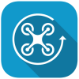

# Drone 360s


## Why Drone 360 photos?

1) You can't beat the location 

2) Great resolution. They stitch well - little or no parallax.  

## How to take a 360 photo with a drone

Mount a 360 Camera on Your Drone - **not recommended**

 - not safe  
 - mediocre results  
 - not necessary!  

Use an app and stitch

## Recommended drones

## Drone 360 Apps {#drone360apps}

<table>

<tr style="background-color:transparent;">

<td class="appicon" style="border:none;"><br/>
</td>

<td class="appdesc" style="border:none;">**DJI GO 4**. [Android](https://play.google.com/store/apps/details?id=dji.go.v4){target="_blank"} | [iTunes](https://itunes.apple.com/us/app/dronepan/id1026329337){target="_blank"}<br/>
**DJI Fly**. [Android](https://play.google.com/store/apps/details?id=dji.go.v5){target="_blank"} | [iTunes](https://apps.apple.com/us/app/dji-fly/id1479649251){target="_blank"}

**DJI GO 4** (Phantom 4, Mavic Pro, Phantom 4 Pro, or Inspire 2) and **DJI Fly** (Mavic Air 2, Mini 2, and Mavic Mini) cover the bulk of DJI's consumer drones. If you have one of these drones, you need one of these apps to set important configuration settings such as the return-to-home altitude. As a nice perk, they also both feature a panorama camera mode. 

To take a 360 photo with one of these apps, you manually fly to your photo location, make sure the camera is in panorama mode, then trigger the camera. The app will then take control of the drone and capture a sequence of photos (up to 34 for a full 360 panorama). The app will even stitch the photos for you, either immediately or after the flight. 

These apps actually have 4 panorama modes - sphere (full 360), 180 (very wide), horizontal (less wide), and vertical. For details, see the app documentation or tutorials like [this one for DJI GO 4](https://www.youtube.com/watch?v=8DoHaxWpu1s){target="_blank" rel="noopener"} on YouTube.

The panorama stitched in the app is relatively low resolution (4096 x 2048), so while its great as a preview and may be fine for social media, it may not be your ultimate product. Fortunately these apps save the images taken to the memory card, giving you the option of stitching them with your own software if you want a higher resolution or want to manually correct some of the edges.

</td>
</tr>

<tr style="background-color:transparent;">
<td class="appicon" style="border:none;"></td>
<td class="appdesc" style="border:none;">**DronePan**. Android *- not supported* | [iTunes](https://itunes.apple.com/us/app/dronepan/id1026329337){target="_blank"}

DronePan is an iOS app that will take over control of DJI drone and take a series of pictures in different directions and pitch angles suitable for stitching into a 360 panorama. To use DronePan, you manually fly your drone to where you want it to take the panorama, then let DronePan take over. The app does not stitch the images together, for that you'll need to use other software or a cloud service.

DronePan is only available for iPhones and iPads running iOS 10.2 or later, and only works with DJI drones. DronePan is open source and free. Version 2.0 came out in  summer 2018.

</td>
</tr>

<tr style="background-color:transparent;">
<td class="appicon" style="border:none;"></td>
<td class="appdesc" style="border:none;">**Litchi for DJI Drones**. [Android](https://play.google.com/store/apps/details?id=com.aryuthere.visionplus){target="_blank" rel="noopener"} | [iTunes](https://itunes.apple.com/us/app/litchi-for-dji-drones/id1059218666){target="_blank"}
<p>Litchi is a full-featured mission planning and flight management app. Among the many flight modes is a Panorama mode that will take a series of images at different angles and pitches. Stitching is not supported. Litchi costs $23-$25.</p>
<p>For more info on Litchi, see the [Litchi](#litchi_appendix) Appendix.</p>

</td>
</tr>

<tr style="background-color:transparent;">
<td class="appicon" style="border:none;"></td>
<td class="appdesc" style="border:none;">**Hangar 360 for DJI Drones**
<p style="font-style:italic;">No longer available</p>
<p style="text-decoration:line-through;">The Hangar 360 app will fly your drone to 300 feet, take 23 still images in different directions and angles, and then land automatically. There's also an option to manually fly it to a location of your choosing, and then activate the picture-taking. At any point, you can take over control (which is probably a good idea for landing). After it lands, *don't turn off the drone*. Wait for the images to transfer from the drone to your device. After the images have been copied to your device, you can choose to upload them to Hangar's cloud processing services. They will stitch the images together, and send you a URL. The results are spectacular. The one potential caveat about Hangar is that if you use their cloud processing services, your 360 will be publicly viewable.</p>


```{r hangarpano, echo=FALSE, screenshot.opts = list(delay = 5), cache = TRUE}
knitr::include_url("https://viewer.hangar.com/360?productId=bYLR7Lrm")
```
*Hangar used to support cloud based processing as part of their iOS app. Alas the app no longer works.*

</td>
</tr>

</table>

## Stitching 

In-app stitching - ok for previews, mobile devices, and social media, but resolution is pretty low.

Use stitching software to get best results.

## Sharing 360s

To get the best resolution, you need a platform that supports high resolutions and multiresolution.

Panellum (requires a Python script to create the multiresolution version)

RoundMe.com with a Pro Account, 

Kuula - ??


