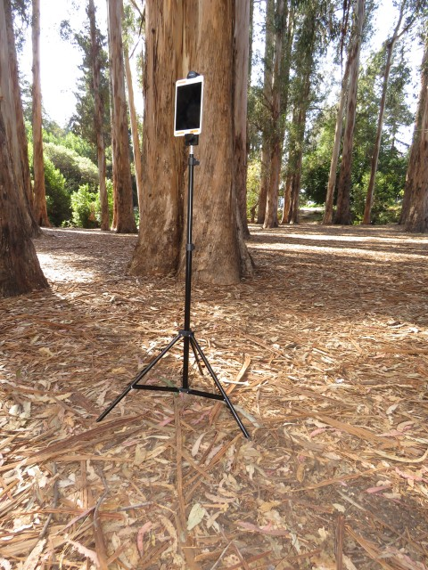

# Equipment

## Cameras 

### Ricoh Theta series 

The Ricoh Theta V, S, and SC are consumer grade 360 cameras that produce very good results. 

Theta SC. resolution: 14MP

See http://www.threesixtycameras.com/ricoh-theta-v-vs-ricoh-theta-s/

### Gear 360 / Gear 360 (2017)

Gear 360 / Gear 360 (2017) Specs:

- Resoultion: 30MP (7776 x 3888)  
- Gear 360 still image resolution:	30MP (2x 15MP sensors)  
- Gear 360 (2017) still image resolution:	15MP (2x 8.4MP sensors)

See also: 

- https://www.androidcentral.com/samsung-gear-360-2017-vs-gear-360-2016

## Phone & Tablets

Features to think about when selecting a phone or tablet to use with your 360 camera:

**Location enabled**. Most 360 cameras don't have GPS receivers in them. Instead, they rely on the location from the device that triggers it. Therefore if you want your photos to have location saved in the EXIF data, make sure your phone or tablet is equipped with a GPS receiever (not all tablets have this feature), and location services are turned on.

**Memory**. Make sure your phone or tablet has enough storage space to hold the photos you collect. 

## Tripods / Monopods

A tripod or monopod gets the camera off the ground and helps you stablize it. Because the 360 photo will include the area directly below the camera, you may wish to use a tripod with a smaller footprint. Some monopods and even selfie sticks have bases with little legs that can work quite well.

Note however there's a trade-off between using a tripod with a smaller base and its stability. Although 360 cameras are not terribly heavy, a gust of wind or uneven ground could topple it over. Also, soft ground such as grass or leaf liter can make it difficult for the legs to stay put.

  
*Light stand with a tablet holder mount*

To improve stability, consider using a regular tripod but only extend the legs as far as needed for stability. Light stands can work well also. You can also anchor the legs with weights, sand bags, or stakes.

  
*Sandbags, weights, or stakes can help anchor the legs of a monopod on soft ground*

## Painters Pole

For a higher perspective that doesn't require the use of a drone, you can mount your camera on top of a painters pole or even a broomstick with a threaded end. You'll also need an adapter with a 1/4" thread that can  screw on top of the pole, such as ProPole from [ClickSnap](https://www.clicksnap.net/){target="_blank"}. 

{.indented2}

## Helmet Mount

A helmet mount is useful for recording photos using your camera's automatic time lapse mode while walking. This is a common way of capturing 360 photos for a trail or transect that you want to share via Google Street View. 

  
*When wearing a helmet mount, remember to keep your head up and look forward so the camera stays vertical*

For instructions on building a helmet mount from a skateboard helmet, see the Appendix [Building a Helmet Mount](#helmet-mount-appendix).

## Accessories 

Tripod ball head. 

Power pack.

