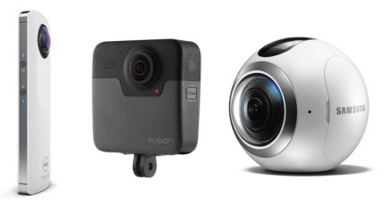
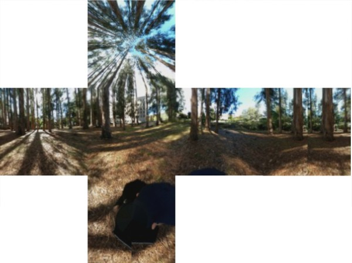
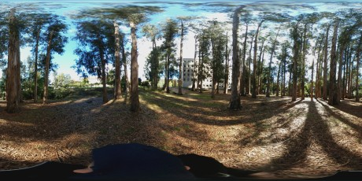
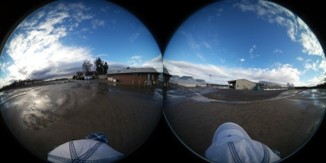
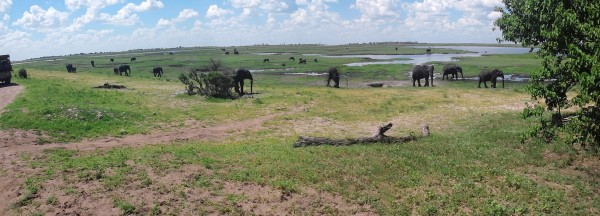

# Glossary

**360 camera / spherical camera**. Cameras that have two or more fisheye lenses which can be triggered at once. These images can then be stitched into a 360 image either by the camera or an app. 

*Spherical cameras: Ricoh Theta S, GoPro Fusion, Samsung Gear 360*

**360 photo**. A general term for a photo that wraps around 360 degrees horizontally. See also *360 panorama*.

**360 panorama**. A panorama that wraps all the way around, but does not include directly above or below.

**360 tour**. One or more 360 photos displayed interactively with links between them, hotspots you can click on, popup-windows, menus, etc. See also [tour node](#tournode).

**cubic projection**. Another way to store a 360 photo in a 2D file format. Each side of the image is saved a square image which collectively comprise a cube. Cubic projections are commonly used in 3D gaming software.

*The cubic projection stores each side of a 360 photo as a 2D image*

**equirectangular image format**. One of the image formats for a full 360 photo sphere, where the image is saved as a JPG with an aspect ratio of 2:1. See also [cubic projection](#cubic).

  
*Equirectangular images are 360 images saved as a regular JPG with an aspect ratio of 2:1. The top and bottom look distorted when viewed as a regular image, but look fine in a 360 viewer.*

**EXIF data**. Information about a photo saved in the 'header' of the file. Typically this includes the camera model, time taken, GPS coordinates, etc.

**GigaPan**. A tripod head that has a little motor and controller to automate taking a series of still images suitable for stitching into a panorama.

**HDR**.  High Dynamic Range imaging is a technique for taking photos of scenes with a lot of contrast (e.g., very bright and very dark areas). Essentially, multiple photos are taken at different aperature settings, and combined using software. Because multiple photos are taken in succession, HDR photos of objects in motion can be blurry.

**hemispheric format**. A format for photo sphere where two hemispheric photos are displayed side-by-side, not yet stitched.

  
*Hemispheric or fish images are another format for 360 images saved as a regular JPG. The two sides still have to be stitched.*

**nadir**. The point directly below the camera

**nodal point**. The exact center of a lens.

**panorama**. A very wide photo that may or may not wrap all the way around, but typically does not include above or below.

  
*Panorama photos are long and wide, but may or may not wrap all the way around*

**photogrammetry**. The science of reconstructing a 3D surface from a set of overlapping photos taken from different locations

**photosphere**. A photo that wraps 360 degree horizontally as well above and below.

**spherical panorama**. Same thing as a photosphere. 

**tour node**. A single 360 image in a tour
