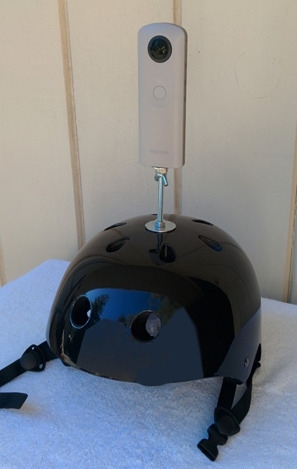
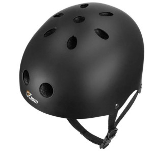
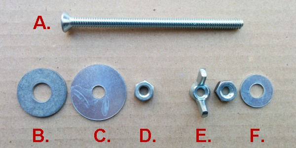
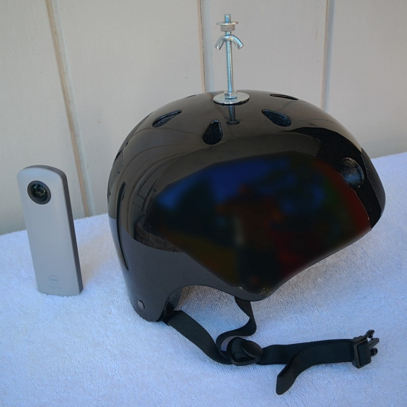

# Building a Helmet Mount {#helmet-mount-appendix}

## Why a Helmet Mount

Mounting a 360 camera on a helmet allows you to take a series of 360 images while walking or riding a bike, thereby covering a long distance relatively quickly. Typically, you would set the camera to trigger automatically on a time lapse. Helmet mounts are commonly used when the goal is a series of 360 photos to be contributed to Google Street View. (Note however the Google Street View app recommends walking, not riding a bike, so images are close enough to automatically link to the next.)

Although there are commercial helmet mounts for GoPro and other action cameras, these may or may not work with a 360 camera that uses a standard tripod screw. Fortunately it isn't very difficult to build a mount for a 360 camera, because a tripod screw is simply a standard 1/4" machine screw.

Although you can attach a mount for a camera on any kind of head gear, sport helmets have the advantage of being sturdy which is important as you don't want your camera to fall off. They are also rigid, which helps keep the camera vertical. Helmets also have padding and straps which help them stay in position and be relatively comfortable.

## Parts

### A Helmet 

Most helmets will work provided you can mount a 1/4" machine screw on top. A bicycle helment with ventilation slots might work if you can thread the screw through a short brace and then secure it with cable ties.

If you're getting a helmet specifically for the purpose of mounting a camera, look for one that is dark in color which won't affect the camera's white balance, and won't be a distraction in the photos. Another good feature to look for is hole in the top. Many skakeboard helmets have ventilation holes on top, so you don't have to do any drilling, and can be purchased for around $20.

  
*Skateboard helmets often have a conveniently located hole at the top.*

### Hardware Pieces

The rest of the hardware pieces can be bought at a standard hardware store for less than $2.

A. **1/4 x 4" flat head machine screw**. The head goes inside the helmet. A flat head provides the lowest profile so the end isn't rubbing against your scalp. 

B. **3/8" x 1" washer**. This goes inside the helmet also. The larger diameter of the inner circle reduces the portion of the machine screw head that juts out.

C. **5/16" x 1 1/4" washer**. The bigger washer goes on the outside of the helmet, and is secured with a standard 1/4" nut (D). You can paint the washer black to make it less noticable in the photos.

D. **1/4" nut (x2)**.

E. **1/4" wing nut**. A wing nut allows you to tighten and untighter the screw that keeps the camera by hand. *Never over-tighten anything that screws onto a tripod*, you risk damaging it or not being able to get it off!

F. 5/16" x 1/2" washer. Prevent scratching the bottom of the camera.

## Assembly

The assembled mount looks like:

  
*Ready for action!*
