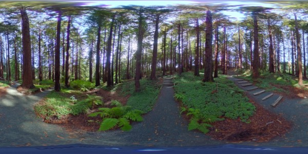

```{r hrecpano, echo=FALSE, screenshot.opts = list(delay = 5), cache = TRUE}
knitr::include_url("https://roundme.com/embed/VWUCq5qEIqCTeF6Hh6CG")
```

# Preface {-}

360 photos provide immersive viewing experiences and are easier and cheaper than ever to create. People and organizations are using 360 photos to share experiences, show what a place looks like in person, and convey all sorts of information about a what makes a place unique and special.

Although the equipment and software behind this technology have gotten dramatically easier and cheapr to use, the field is still fairly young. There are a number of hardware options to consider, shooting techniques, software, and dissemiation choices. Ultimately, the choice of tools should match the needs of the project and the amount of time and resources available.


{style="margin-left:2em;"}

This guide describes techniques for using consumer grade 360 photography hardware and software. We do not attempt to cover creating high quality 360 photos using high end DSLR cameras with special tripod heads and processing software. For that, see the many excellent tutorials online, YouTube videos, and online short courses available. This guide does also not cover 360 video, although many of the considerations will be the same.

\
[](http://igis.ucanr.edu/){target="_blank"}

---

<a rel="license" href="http://creativecommons.org/licenses/by-nc-sa/3.0/us/"></a><br />This work by [Andy Lyons](http://igis.ucanr.edu/People/?facultyid=32909) is licensed under a <a rel="license" href="http://creativecommons.org/licenses/by-nc-sa/3.0/us/">Creative Commons Attribution-NonCommercial-ShareAlike 3.0 United States License</a>.


