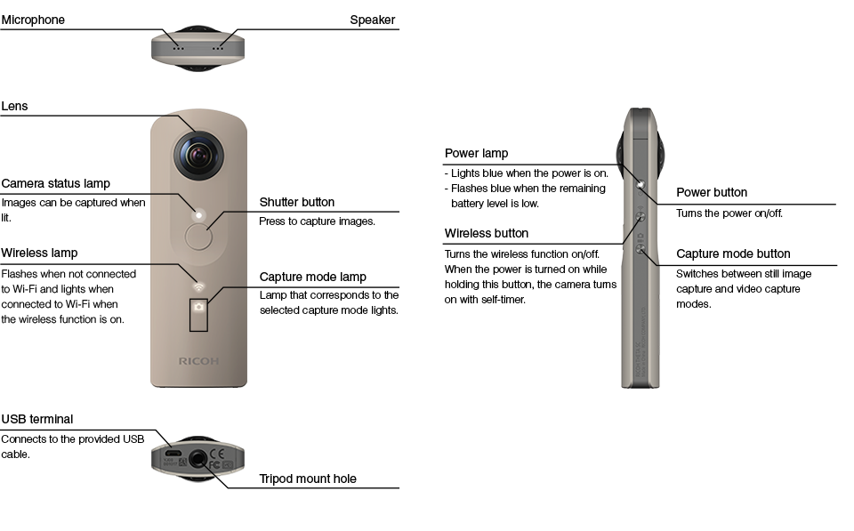
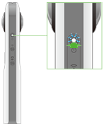
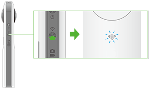
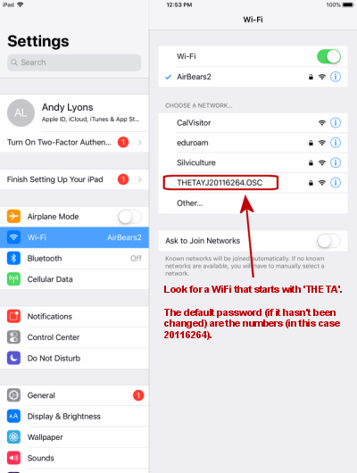
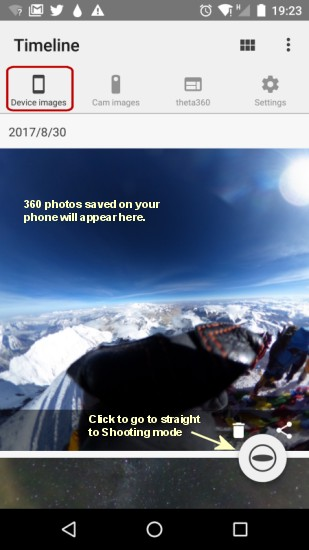
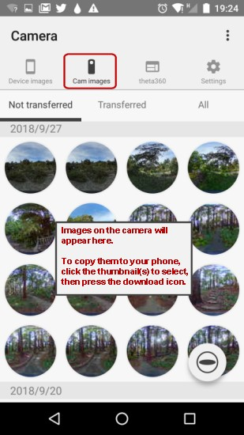
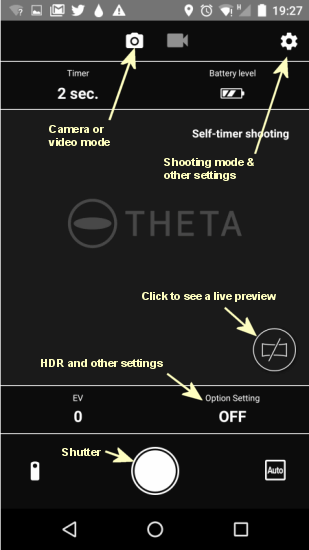
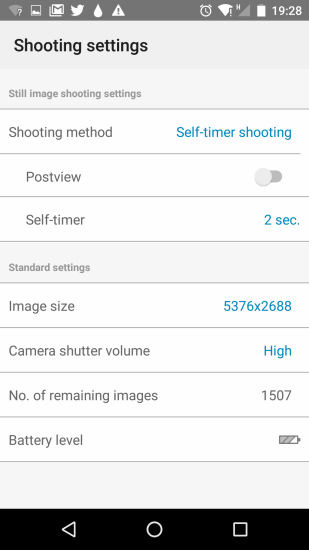

# (APPENDIX) Appendix {-} 

# Theta SC Step-by-Step

The Ricoh Theta SC is a consumer grade 360 camera. The Theta SC is a pared down version of the Theta S, the main differences being the Theta SC cannot live-stream 360 footage,   continuous video recording time is limited to 5 minutes, and the compass direction is not recorded. In all other respects, the models are the same. 

The Theta SC has 8Gb of internal memory, which is not expandable. You should be able to take about 260 photos on one battery charge. The Theta SC has a micro-USB port which is used both for charging as well as transferring images to a computer. The camera also gives a WiFi signal, which you can use to connect to the camera with a app. The apps you'll probably use with the Theta SC are the Theta  or the Google Street View apps.

## Camera Diagram

## Taking and Viewing Photos

1. **Preparation**. Before going to the field, make sure your Theta SC is charged up. If you'll be taking a lot of photos, consider deleting any existing photos in the camera (connect it to a computer with the USB cable).

\
2. **Turn on the camera** by pressing the button on the side.

{style="margin-left:2em;"}

\
3. **Turn on the WiFi** on the camera, if it isn't on already. The little WiFi light on the front of the camera should appear white.

{style="margin-left:2em;"}

\
4. **Connect to the Theta's WiFi** on your phone or tablet. Look for a WiFi signal that starts with THETA. If someone hasn't changed the default password, it will be the numbers in the SSID. This can also be read on the label on the bottom of the camera. It's possible to change the  WiFi and password using the Theta app.

{style="margin-left:2em;"}

*Being connected to the camera's WiFi doesn't mean you have internet access*. In fact you probably won't have internet unless you have another internet connection, for example through your cellular provider. The camera's WiFi merely allows your phone or tablet to control the camera.

\
5. **Start the Theta app** on your phone or tablet. The first screen you'll see will display any 360 photos you have saved on your phone. 

{style="margin-left:2em;"}

\
The next button will display any photos saved on the camera you're connected to. If you want to copy them to your phone or tablet, select the images and click the download icon. Note you can also copy images from the camera directly to a computer using a USB cable.

{style="margin-left:2em;"}

\
6. **Go to 'shooting mode'** by clicking the Theta icon that looks like an eyeball. 

{style="margin-left:2em;"}

\
You're now ready to start taking photos by clicking the shutter button. 

**Remember**: when you take pictures using the Theta app, the photos are saved on the camera. They are only copied to your phone when you copy them over using the 'Cam Images' screen. 

## Settings

Additional settings you can explore:

**Timer**. To give yourself a few seconds to hide. Click on the Settings icon and change the Shooting method to 'self-timer'.

**HDR mode**. Click the Option Setting label, then slide the dial until HDR Rendering is selected. 

{style="margin-left:2em;"}

